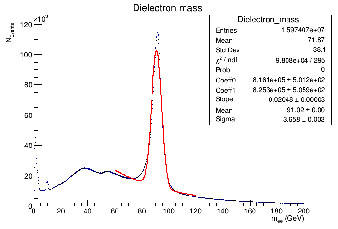

# HASCO 2023 - ROOT Tutorial

These are the exercises for the ROOT tutorial for the [HASCO 2023](https://indico.cern.ch/event/1243861/timetable/) summer school.

## 0 - Setup

We will use the Jupyter notebook to run all the exercises. To get into the right environment, please proceed as follows:

- Open a file manager and go into the `ROOT_tutorial` directory
- Create a subdirectoy with a unique name (like `firstname_lastname`)
- Close the file manager and open a terminal
- Type `jupyter-notebook` and hit enter
- Ignore the chromium warnings
- You should now have the Jupyter notebook opened in the browser
- In the notebook, navigate into the subdirectory of `ROOT_tutorial` you created for youself in the first step
- You can now create new notebooks with the `Python 3 (ipykernel)` and do the exercises!

All of the exercises will be written in Python with PyROOT. If you are stuck, don't look at the solution immediately! First, try to get help from:
1. The lecture slides
2. The internet (Google usually gives you the right links to the ROOT documentation and ROOT forum)
3. Your colleagues

## 1 - Histograms, graphs, and functions

### 1.1 - Creating a histogram
Create a notebook which builds and draws a histogram with the following features:
- The number of bins is 50 and the x axis ranges from 0 to 10.
- It is filled with random numbers distributed according to an exponential distribution which has a rate = 0.5.
  Suggestion: see the [TRandom](https://root.cern.ch/doc/master/classTRandom.html) for generating random numbers or
  [TH1::FillRandom](https://root.cern.ch/doc/master/classTH1.html#random-numbers)
- Its line width is thicker than the default one.

### 1.2 - Creating a graph
Create a notebook which builds and draws a graph with the following features:
- The title of the plot is *My graph*.
- The x and y axis have labels `my_{X}` and `my_{Y}` respectively.
- It has three points with the following coordinates (1,0), (2,3), (3,4).
- The marker is a full square. Its coulour is red.
- An orange line joins the points.

### 1.3 - Creating a function
Create a notebook that follows these steps:
- Create a function with formula *cos(x)* and draw it.
- Create another *cos(x)*, but scale the argument of the cosine by adding a parameter.
- Set a value for the parameter.
- Change the line color of the second function.
- Draw the second function in the same canvas as the first one.

## 2 - Fitting with RooFit

In this exercise, you will get familiar with RooFit, because this is the library that is usually used for the liklihood fits in physics analyses.

- Download the [RooFit tutorial](notebooks/roofit-tutorial-01.ipynb) from this repository, which can also be done by cloning this repository with `git`.
- Run the notebook while trying to broadly understand that is happening in each step.
- The exercises are written at the bottom of the notebook

## 3 - Analyzing CMS Open Data with RDataFrame

### 3.1 - First Z boson analysis

In this advanced exercise, you will write a little Z-Boson analysis based on the `DoubleElectron` CMS Open Data from [Run2012B](http://opendata.cern.ch/record/12367) and [Run2012C](http://opendata.cern.ch/record/12368). Behind the links you can also find a description of all the columns in the dataset.

Please try to implement the following steps to **analyze the invariant mass** spectrum of electron pairs in the dataset:
  1. Select events with exactly two electrons
  2. Define a now `Electron_p4` column of type [ROOT::Math::PtEtaPhiMVector](https://root.cern.ch/doc/master/namespaceROOT_1_1Math.html#a6cea5921731c7ac99dea921fb188df31) to represent the electrons
  3. Calculate the invariant mass of the electron pairs
  4. Fill a histogram with the pair masses mass
  5. Fit the invariant mass histogram to model the main resonance peak, with a chi-square fit
     - for the fit model, you can use the sum of a Gaussian and an exponential (for signal and background), selecting an apropriate range around the peak for the fit
  6. Produce a nice plot with the data and the fit result

Can you model the peak accurately to **identify the mass of the Z boson**?

**Hint:**
* The [tutorials](https://root.cern.ch/doc/master/group__tutorial__dataframe.html) are an excellent reference to see RDataFrame examples
* To see the full list of RDataFrame commands, take a look at the [documentation](https://root.cern.ch/doc/master/classROOT_1_1RDataFrame.html)
* This (Higgs Boson Analysis)[http://opendata.cern.ch/record/12360) is a nice example of a CMS Open Data analysis with RDataFrame that your can get inspired by
* You can also use wildcards to open the ROOT files for both runs in one go:
  ```python
  df = ROOT.RDataFrame("Events", "~/CMS_Open_Data/*_DoubleElectron.root")
  ```
* For prototyping, it makes sense to restrict the analysis to a small range of events to get to the result faster:
  ```python
  rdf = rdf.Range(0, 100000)
  ```
  Once you verified that your analysis works in principle, you can run it with the full number of events.

### 3.2 - Improving the Z boson analysis

After doing the last exercise, the plot you have at the end of your Z boson analysis might look like this:



That's already great to be able to achieve such results with a few lines of code starting from real CMS open data! But there are still many things that can be improved. Try to improve some of these aspects:

1. The **fit function**. Is the peak really just a Gaussian? What are the underlying physics processes? Maybe thinking about this could help to find a better fittng function
2. The **object selection**. Many of the selected electrons are not actually from the Z boson: they are "fake" electrons in the detector from background noise, resulting in the exponential background in the mass spectrum. Can you improve the electron selection in the analysis to suppress this background?
3. The **event selection** (*warning, very difficult!*).  In the initial analysis, selected only events with exactly two reconstructed electrons. However, there are many good events that you lose like that, as you can also have true Z boson events with more reconstructed electrons (mostly fake electrons)! Can you improve the event selection to recover such cases?
4. The **fit diagnostics**. Can you add a bottom panel to the plot that shows the difference between the fit model and data in each bin, divided by the statistical uncertainty of the data?

For this last exercise, there is not solution available, as this is a more difficult bonus exercise.
